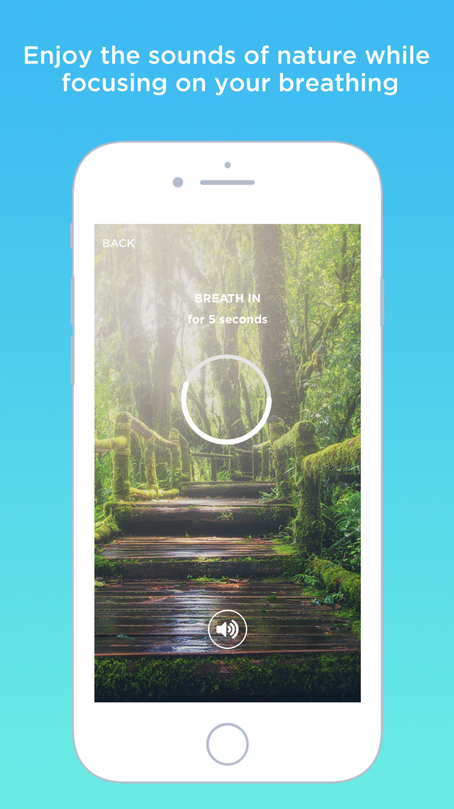

# Calm Meditation & Relaxation - Relax, breathe, focus & sleep

Store Link: https://itunes.apple.com/us/app/calm-meditation-relaxation/id1431521616?ls=1&mt=8

# About

Take a break from all your hard work. 

Relax and enjoy the sounds of nature while focusing on your breathing.

Earn Achievements: Unlock badges and level up as you enjoy your relaxing meditation sessions. Gamify the achieving of your balance through meditation.

# In essence, use Calm Meditation to
- Sleep better,
- Calm your anxiety,
- Slay your stress,
- Reduce stress,
- Breathe more mindfully.

# Use Calm Meditation
- During your morning meditation,
- For your nightly meditation before bed,
- To strengthen your focus,
- To manage your depression,
- On your commute to work or school,
- During your break from college work or class.

As always, we absolutely love your ideas and suggestions. So please, do not hesitate to contact us at any time through our apps or website.

Features Today Widget & Apple Watch App!

 

# Tags
app,for,kids,gamify,calm,coach,focus,help,guided,meditate,meditation,mindfulness,relax,stress,zen